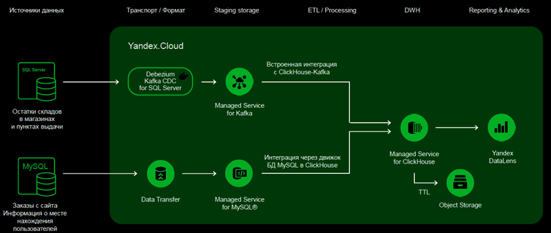
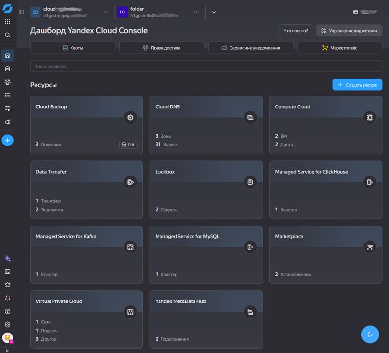
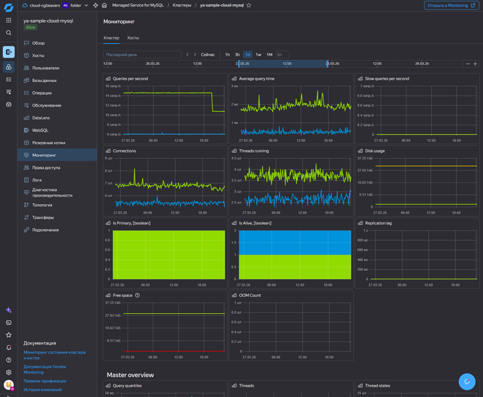
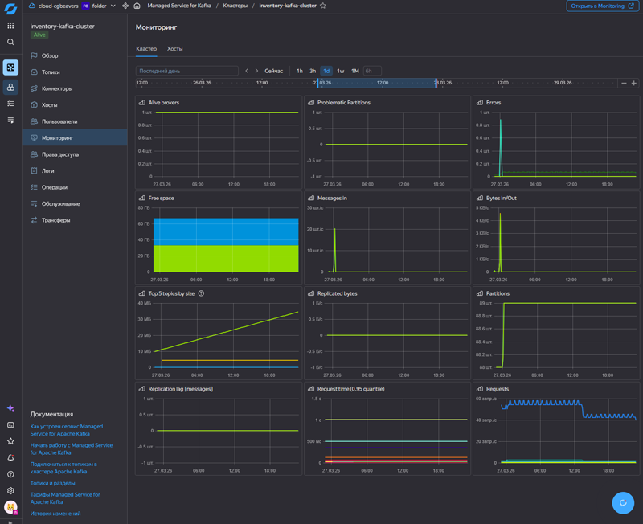
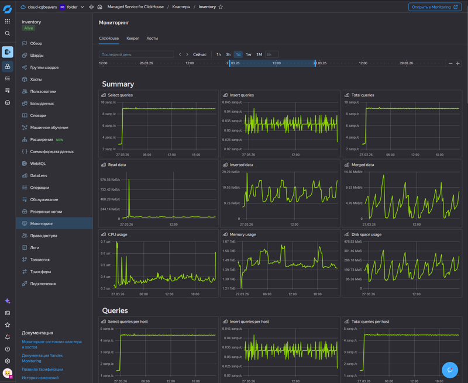
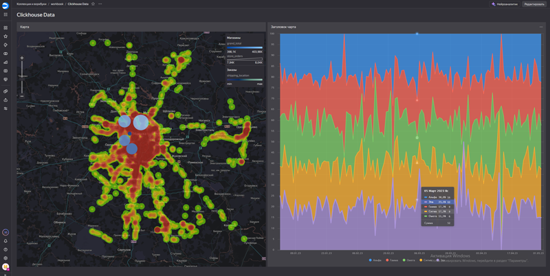

# Описание задачи
- Разработка MVP аналитической платформы маркетплейса на основе ClickHouse.

## Цели
- Развернуть linux ВМ с MySQL и SQL Server в Compute Cloud. Раздать права. Наполнить данными.
- Развернуть реплицируемые кластера Managed Service for Kafka и MySQL.
- Настроить потоковую загрузку в промежуточный слой через Data Transfer и Debezium Kafka CDC для SQL Server.
- Развернуть реплицируемый кластер Managed Service for ClickHouse с гибридным хранением.
- Настроить загрузку данных из промежуточного слоя в аналитические витрины ClickHouse.
- Построить сводный дашборд в DataLens.

